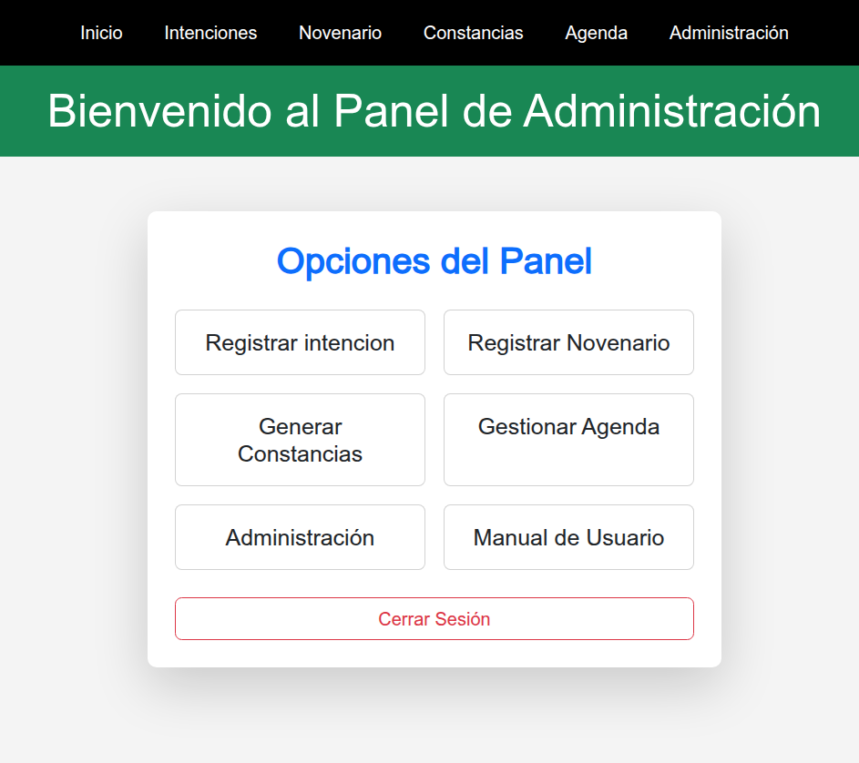
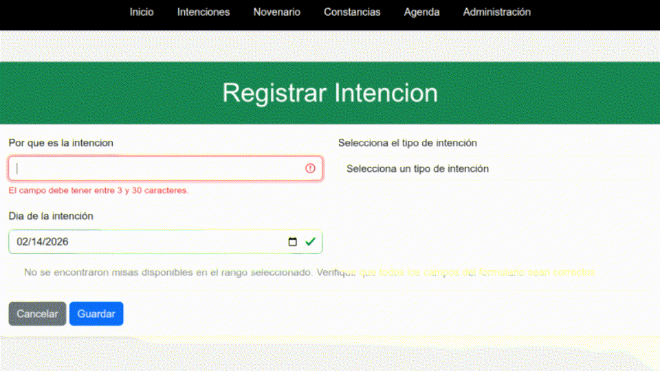
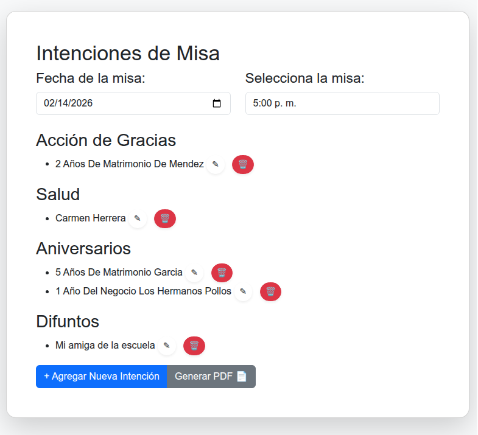
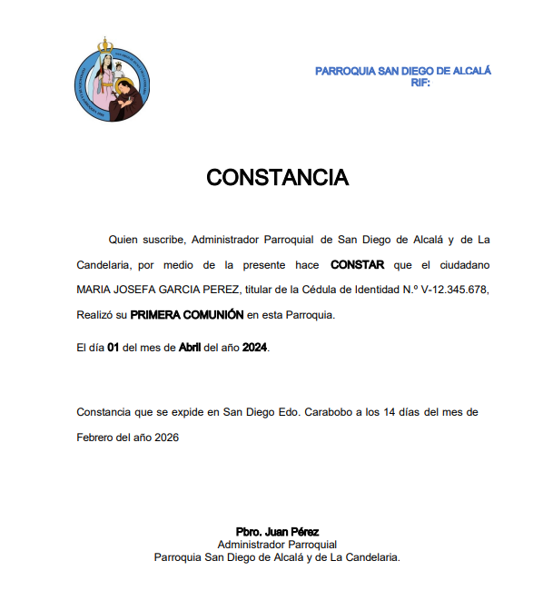
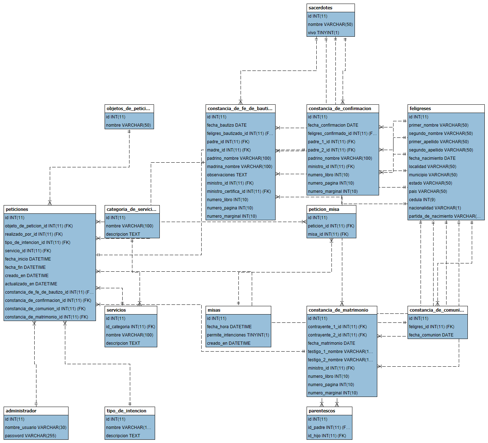

# Sistema de gestión parroquial (PMS)
<p align="left">
  
</p>

> **Nota para el lector:** Este proyecto se desarrolló como proyecto final para una licenciatura en Ciencias Informáticas (2024-2026), al servicio de la parroquia de San Diego de Alcalá y Candelaria.

## 📖 Descripción general

El **Sistema de gestión parroquial** es una aplicación web creada para ayudar a la parroquia a pasar de los registros en papel a un flujo de trabajo digital.

Antes de este sistema, la parroquia dependía de libros físicos y documentos Word manuales, lo que era lento y a menudo daba lugar a errores. Esta solución digitaliza todo el proceso, facilitando la administración de los sacramentos (bautismo, comunión, confirmación y matrimonio) y la gestión de las intenciones de oración diarias.

### 📸 Capturas de pantalla

<p align="left">
  
</p>

<p align="left">
  
  
  
</p>

## Características principales

#### 1. Gestión de registros parroquiales

* **Base de datos centralizada:** realiza un seguimiento del recorrido de un feligrés desde el bautismo hasta el matrimonio en una sola base de datos, sustituyendo los archivos en papel dispersos.
* **Autocompletado inteligente:** el sistema ahorra tiempo al reutilizar los datos existentes. Por ejemplo, al registrarse para la primera comunión, recupera automáticamente los datos del bautismo de la persona, por lo que no es necesario volver a introducirlos.
* **Integridad inteligente de los datos:** aprovecha las transacciones atómicas y `ON DELETE CASCADE` para garantizar que los registros complejos (como `peticiones` y `constancia_de_bautizo`) se guarden perfectamente o no se guarden en absoluto, lo que evita datos huérfanos y guardados parciales.
* **Medidas de seguridad:** mensajes de confirmación integrados y advertencias claras para proteger los registros críticos de su eliminación accidental.

#### 2. Generación automatizada de documentos

* **Motor de certificados PDF:** implementación utilizando la biblioteca [PHPWord](https://github.com/PHPOffice/PHPWord) y [LibreOffice (Headless)](https://www.libreoffice.org/) para generar certificados legales al instante.
* **Se acabaron los errores tipográficos:** como el sistema genera el documento a partir de la base de datos, se eliminan los errores de copiar y pegar habituales en los archivos Word manuales.
* **Borradores editables:** si es necesario realizar un cambio manual, el usuario puede descargar una versión `.docx` en lugar del `.pdf` final.

#### 3. Programación y lógica
* **Evita las reservas duplicadas:** el sistema comprueba automáticamente las fechas para garantizar que las «intenciones de oración» no entren en conflicto.
* **Fácil gestión:** permite al secretario añadir, editar o eliminar fácilmente los horarios litúrgicos.


#### 4. Fiabilidad y mantenimiento

* **Copias de seguridad automáticas:** cada día se ejecuta un script para guardar una copia de la base de datos en una carpeta local. Cuando se combina con Google Drive o OneDrive, esto garantiza que los datos nunca se pierdan.
* **Módulo de autodiagnóstico:** Incluye una «comprobación del estado del sistema» integrada (`/test_diagnostico.php`) que verifica la configuración del servidor tras la implementación. Comprueba:
  * Las extensiones PHP necesarias (ZIP, XML e INTL).
  * La instalación de LibreOffice y la visibilidad de la ruta.
  * Los permisos de escritura del directorio.

#### 4. Fiabilidad y mantenimiento

* **Comprobación del estado del sistema:** incluye una página de autocomprobación (`/test_diagnostico.php`) que comprueba si el servidor está listo (verificando las extensiones PHP, los permisos y el estado de LibreOffice) para evitar problemas de implementación.

---

## 🛠️ Pila técnica

* **Backend:** PHP (enfoque nativo/MVC)
* **Gestor de dependencias:** Composer
* **Base de datos:** MySQL/MariaDB (15 tablas)
* **Frontend:** HTML5, CSS3, JavaScript (jQuery)
* **Metodología:** Programación extrema (XP): desarrollo iterativo con comentarios continuos del párroco y el secretario.
* **Herramientas externas:**
  * **LibreOffice:** se utiliza en modo sin interfaz gráfica para la conversión de `.docx` a `.pdf`.
  * **PHPWord:** para el procesamiento de plantillas.

## Arquitectura de la base de datos

El sistema utiliza un **esquema relacional normalizado (MySQL/MariaDB)** en 15 tablas, optimizado para una estricta integridad de los datos y la automatización de la lógica empresarial específica de la parroquia.

### Cómo funciona
* **Reglas estrictas (restricciones):** Utilizamos comprobaciones SQL para detener los datos erróneos antes de que entren en el sistema. Algunos ejemplos son:
* `chk_roles_familiares_distintos`: garantiza que el niño, la madre y el padre que figuran en un registro de bautismo sean tres personas diferentes.
* `chk_cedula_partida_nacimiento`: garantiza que cada feligrés tenga al menos un documento de identidad válido (documento nacional de identidad o certificado de nacimiento).
* **Transacciones centralizadas:** La tabla `peticiones` actúa como un centro neurálgico. Vincula las solicitudes de servicio con un sacramento específico o una intención de misa, manteniendo los registros organizados.

### 🧬 Diagrama de relaciones entre entidades (ERD)


### 🚀 Instalación y configuración

**Requisitos previos:**
* **Servidor:** Apache
* **PHP:** Versión 8.4+
* **Extensiones:** Asegúrese de que `extension=zip`, `extension=intl` y `extension=gd` estén habilitadas en `php.ini`.
* **Base de datos:** MySQL 5.7+ o MariaDB.
* **Motor PDF:** LibreOffice (debe estar instalado en el equipo host).

**Pasos:**

1. **Clonar el repositorio:**
```bash
git clone https://github.com/EGA-SUPREMO/Sistema-de-Gestion-Parroquial.git

```

2.  **Instalar dependencias:**
Navega a la carpeta del proyecto y ejecuta:
```bash
composer install
```

3.  **Configuración de la base de datos:**
    * Crea una base de datos llamada `gestion_parroquial_db`.
    * Importa el archivo `sql/gestion_parroquial_db.sql`.

4.  **Configuración:**
    * Cambie el nombre de `template.env` a `.env` y actualice las credenciales de la base de datos.
    * Establezca `DB_DIR_BACKUP` en una ruta válida (preferiblemente una carpeta sincronizada en la nube).
 
    * **Usuarios de Windows:**
        * Si utiliza Windows 11, asegúrese de que los archivos de plantilla en «public/plantillas/» no estén «bloqueados». (Haga clic con el botón derecho del ratón en el archivo -> Propiedades -> Desbloquear).
 
5.  **Ejecute la comprobación del sistema:**
    * Vaya a «http://localhost/test_diagnostico.php».
    * Asegúrese de que todas las luces de estado estén en verde (Bibliotecas, Permisos, LibreOffice). Si «LibreOffice» está en rojo, la generación de PDF fallará (recurriendo a .docx).

---

### Contexto académico

Este proyecto se llevó a cabo como proyecto final para obtener un título de Asociado en Ciencias (A.S.) en Informática.

* **Objetivo:** Optimizar la ejecución y la prestación de servicios para la parroquia de San Diego de Alcalá.
* **Metodología:** Programación extrema (XP).
* **Recopilación de datos:** Encuestas con escala Likert y análisis de datos basados en censos.

## Licencia
Este proyecto está licenciado bajo la [Licencia Pública General de GNU (GPL) versión 3](LICENCIA)

Traducción realizada con la versión gratuita del traductor DeepL.com 
